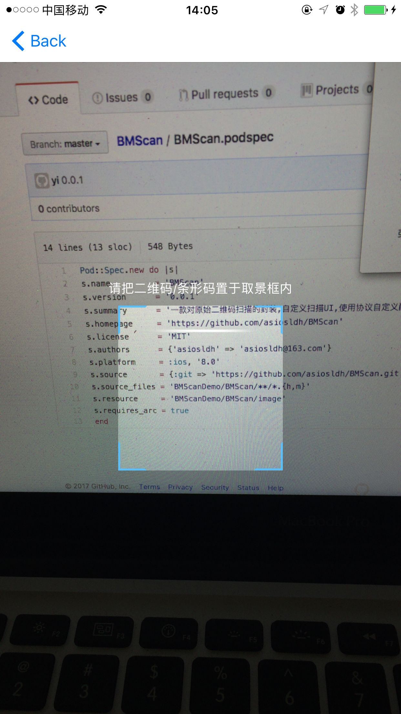
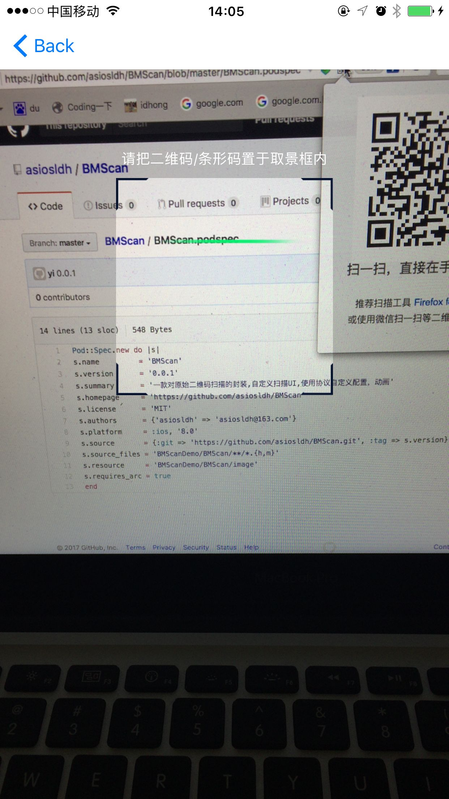

# BMScan
> 对系统扫描功能的封装，集成了扫描相关 UI 和自定义识别区域等功能，最简单的使用需要继承于 `BMScanController` 或者 `BMScanDefaultCotroller`即可。     

 
[](http://cocoapods.org/pods/SMCustomViewXIB) 
[](http://cocoapods.org/pods/SMCustomViewXIB) 
[](http://cocoapods.org/pods/BMScan) 
[](https://www.apple.com/nl/ios/) 
[](http://weibo.com/liangdahong) 
[](https://github.com/asiosldh/BMScan/stargazers)
## 效果图 




## CocoaPods
CocoaPods is the recommended way to add BMScan to your project.
Add a pod entry for BMScan to your Podfile.

```Ruby
pod 'BMScan', '~> 0.0.1'
```		
Second, install BMScan into your project:

```Ruby
pod install
```

## 使用说明

### 只需要扫描功能

- 创建扫描控制器继承于 `BMScanController `
- 配置 `BMScanDelegate` 代理
- 当扫描到内容时回会触发下面的代理方法


```c
- (void)scanController:(BMScanController *)scanController captureWithValueString:(NSString *)valueString;
```

- 如果想在开始扫描和结束扫描时做额外的操作可以重写下面的方法,需要先调用 `super`,已用`NS_REQUIRES_SUPER `修饰

```c
/**
 开始扫描
 */
- (void)startScanning NS_REQUIRES_SUPER;

/**
 结束扫描
 */
- (void)closureScanning NS_REQUIRES_SUPER;
```

### 自定义扫描 UI
- 如果需要自定义扫描UI，扫描动画可以继承于 `BMScanDefaultCotroller `可轻松实现常见功能，也可以完全继于`BMScanDelegate `自行实现
- 创建扫描控制器继承于 `BMScanDefaultCotroller `
- 配置 `BMScanDelegate` 和  `BMScanDefaultDataSource` 代理
- 参考代理中的方法实现相关功能即可
- 
#### 自定义透明扫描区域
```c
/**
 扫描区域 X 值

 @param scanController 扫描控制器
 @return X 值
 */
- (CGFloat)areaXInscanController:(BMScanController *)scanController;

/**
 扫描区域 Y 值
 
 @param scanController 扫描控制器
 @return Y 值
 */
- (CGFloat)areaYInscanController:(BMScanController *)scanController;

/**
 扫描区域 Width 值
 
 @param scanController 扫描控制器
 @return Width 值
 */
- (CGFloat)areaWidthInscanController:(BMScanController *)scanController;

/**
 扫描区域 Height 值
 
 @param scanController 扫描控制器
 @return Height 值
 */
 - (CGFloat)areaXHeightInscanController:(BMScanController *)scanController;
```

#### 标题距扫描区域的距离
```c
/**
 标题距扫描区域的距离

 @param scanController 扫描控制器
 @return 距离
 */
- (CGFloat)areaTitleDistanceHeightInscanController:(BMScanController *)scanController;
```

#### 非扫描区域的颜色（半透明区域）
```c
/**
 标题距扫描区域的距离

 @param scanController 扫描控制器
 @return 距离
 */
- (CGFloat)areaTitleDistanceHeightInscanController:(BMScanController *)scanController;
```

#### 4个拐脚的颜色
```c
/**
 脚颜色

 @param scanController 扫描控制器
 @return 颜色值
 */
- (UIColor *)feetColorInscanController:(BMScanController *)scanController;
```

#### 4个拐脚的颜色分别自定义
```c
/**
 左上脚颜色
 
 @param scanController 扫描控制器
 @return 颜色值
 */
- (UIColor *)leftTopColorInscanController:(BMScanController *)scanController;

/**
 左下脚颜色
 
 @param scanController 扫描控制器
 @return 颜色值
 */
- (UIColor *)leftBottonColorInscanController:(BMScanController *)scanController;

/**
 右上脚颜色
 
 @param scanController 扫描控制器
 @return 颜色值
 */
- (UIColor *)rightTopInscanController:(BMScanController *)scanController;

/**
 右下脚颜色
 
 @param scanController 扫描控制器
 @return 颜色值
 */
- (UIColor *)rightBottonInscanController:(BMScanController *)scanController;
```

#### 扫描线颜色
```c
/**
 扫描线条颜色

 @param scanController 扫描控制器
 @return 颜色值
 */
- (UIColor *)scanfLinInscanController:(BMScanController *)scanController;
```

#### 扫描条动画
>待补充更多样式和自定义样式

```c
/**
 扫描线条动画

 @param scanController 扫描控制器
 @return 动画值
 */
- (BMScanLinViewAnimation)scanLinViewAnimationInscanController:(BMScanController *)scanController;
```

#### 可识别区域

>可以继于`BMScanDefaultCotroller`不需要考虑，内部会有扫描区域来确定`可识别区域`,如果有特殊要求可实现`BMScanDataSource`协议的如下方法即可

```c
/**
 设置可以识别区域

 @param scanController 扫描控制器
 @return 可识别区域
 */
- (CGRect)rectOfInterestInScanController:(BMScanController *)scanController;
```
### 方法预览
- [BMScanDelegate](https://github.com/asiosldh/BMScan/blob/master/BMScanDemo/BMScan/Cotroller/BMScanDelegate.h),  [cocoapods文档](http://cocoadocs.org/docsets/BMScan/0.0.1/Protocols/BMScanDelegate.html)
- [BMScanDataSource](https://github.com/asiosldh/BMScan/blob/master/BMScanDemo/BMScan/Cotroller/BMScanDataSource.h),  [cocoapods文档](http://cocoadocs.org/docsets/BMScan/0.0.1/Protocols/BMScanDataSource.html)
- [BMScanDefaultDataSource](https://github.com/asiosldh/BMScan/blob/master/BMScanDemo/BMScan/Cotroller/BMScanDefaultDataSource.h),  [cocoapods文档](http://cocoadocs.org/docsets/BMScan/0.0.1/Protocols/BMScanDefaultDataSource.html)

## Contacts
##### Sina : [@梁大红](http://weibo.com/3205872327)
##### blog : [@idhong](http://idhong.com)
##### 有任何问题可与我联系

## License
BMScan is released under the [MIT license](LICENSE). 